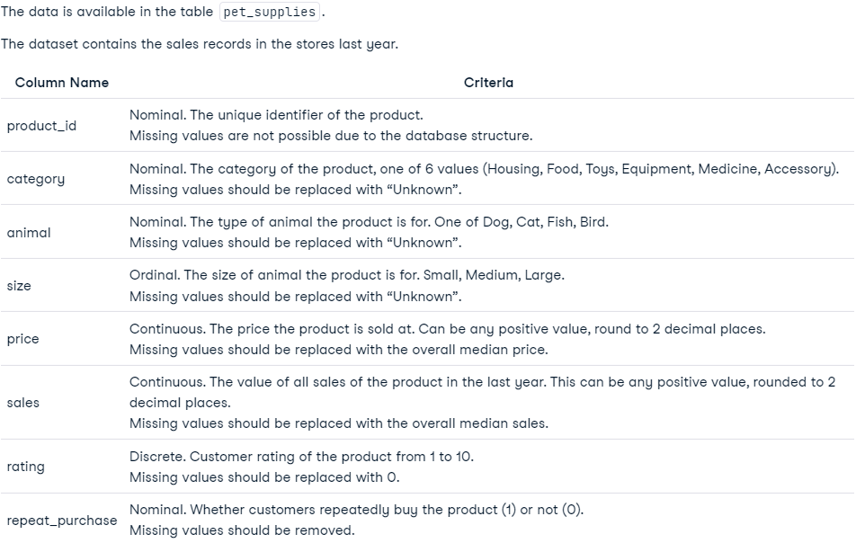
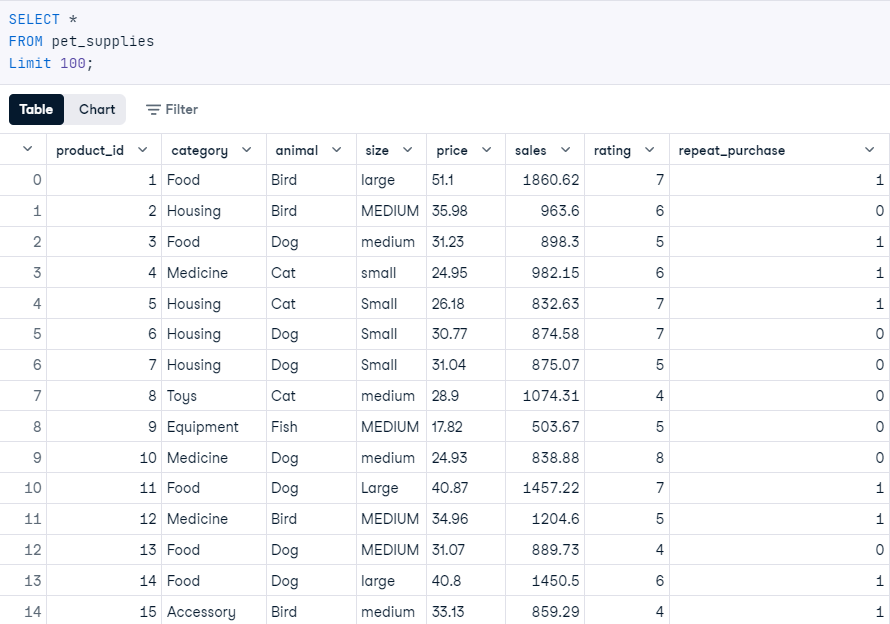
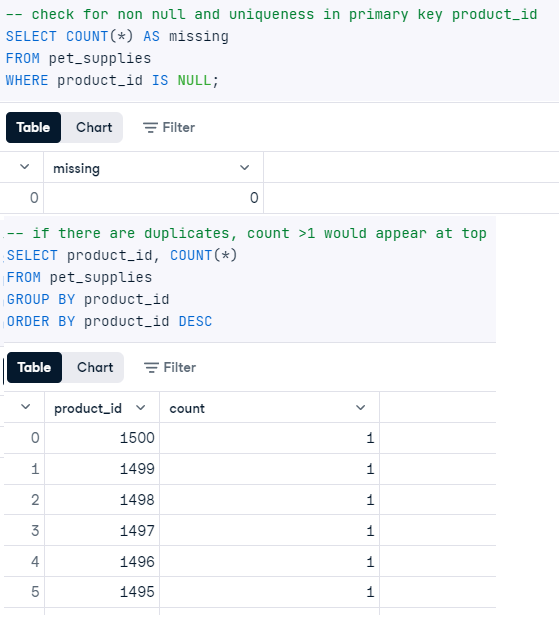
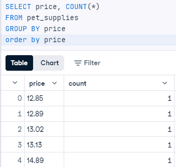
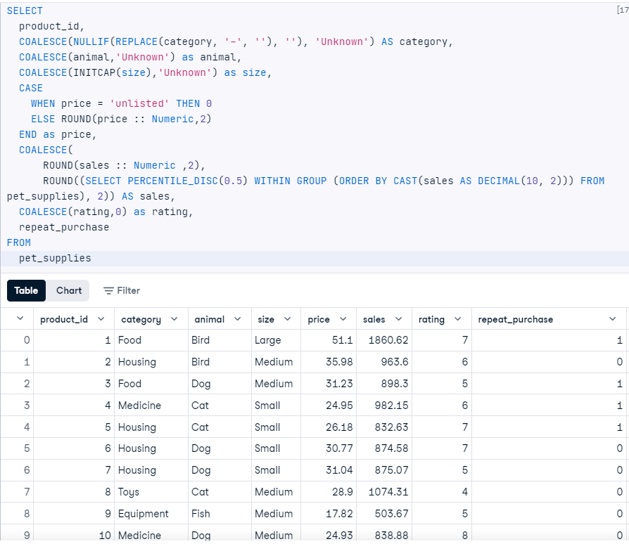
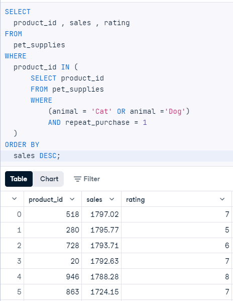

# PetMind : Pet Supplies
PostgreSQL Data Cleaning and Exploration
DataCamp DA Associate SQL Sample Practical

## The Business 
PetMind, a U.S.-based pet product retailer, sells a mix of luxury and everyday items, like toys and food. To boost sales, they’ve been focusing on increasing repeat purchases over the past year and now seek a report on how these repeat purchases affect sales.

## Data

### Task 1 : 
Make sure the data is cleaned to match Criteria.

#### Initial Checks

**Observations:**
*    There are '-' in category 
*    There are different case size for text in size Eg. medium , MEDIUM , Medium
*    some rows in price is 'unlisted'
*    There are nulls in rating column
  
#### Check that Primary Key is unique and do not contain nulls  

 
**Observations:**
Primary Key is unique and do not contain nulls
  
#### Check numeric columns datatypes

#### Check there are no negative values in price

**Observations:**
*    Price is text datatype , correction needed cast to numeric
*    There are no negative values in Price

#### Clean Data
*    REPLACE '-', ' ' as NULL in category then COALESCE as 'Unknown'
*    COALESCE nulls and 'Unknown' (this is just in case there was undetected nulls)
*    Prices have to be numeric 2 DP. Missing values should be replaced with 0.
*    Sales have to be numeric positive 2 DP. Missing values to be replaced by Median : PERCENTILE_CONT() Window Function
*    Ratings are from 1-10. COALESCE nulls as 0
After completing above steps data would meet the set criteria. Data can be exported at this point to do further analysis or visualizations with other tools

### Task 2 :
You want to show whether sales are higher for repeat purchases for different animals. You also want to give a range for the sales.
Write a query to return the animal, repeat_purchase indicator and the avg_sales, along with the min_sales and max_sales. All values should be rounded to whole numbers.
*You should use the original pet_supplies data for this task.*

**Observations:**
*    The highest average sales for repeat purchases is for birds followed by dogs then cats
*    The highest average sales for non repeat purchases is for birs again followed by dogs then cats
*    Sales for repeat purchases are higher than non repeat purchase this is true for birds
*    But for dogs and cats non  repeat purchases see a higher average value than repeat purchases

### Task 3 :
The management team want to focus on efforts in the next year on the most popular pets - cats and dogs - for products that are bought repeatedly.
Write a query to return the product_id, sales and rating for the relevant products.
*You should use the original pet_supplies data for this task.*

**Observations:**
*    Data is filtered to show only repeat purchases fpr Dogs and Cat
*    top 5 most popular product_ids in order of decending sales : 518 , 280, 728, 20, 946
*    It is important that these items are kept in stock to prevent loss of sales
*    Ratings for product_id 280 and 728 is not doing well, further investigations needed 

### Conclusions:
*    Initial exploration of the database in Task 2 suggest that birds are the pets that bring in the most sales 
*    This conflicts with managment believe that Dogs and Cats are the most popular pets
*    Investigation into bird item sales needs to be carried out as to what contribute to such high sales for these supplies
